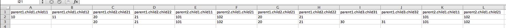

This module lets you create an excel file out of an array of javascript objects.  The objects are flattened using [flatjson](https://github.com/freezer333/flatjson).  The resulting excel sheet has one column per key in the flattened objects.  Each row in the excel sheet corresponds to the values of each object in the input array.

The array of objects do not necessarily need to have the same set of keys - but the excel sheet will have the union of all keys as the column list.

# Example Usage

```js
toxl = require('jsonexel');
fs = require('fs');

var test = [
    {
        parent1: {
            child1: {
                child11: 10, 
                child12: 11
            }, 
            child2: {
                child21: 20, 
                child22: 21
            }
        }, 
        parent2 : {
            child1: {
                child11: 101, 
                child21: 102
            }
        }
    }, 
    {
        parent1: {
            child2: {
                child21: 20, 
                child22: 21
            }, 
            child3: {
                child31: 30, 
                child32: 31
            }
        }, 
        parent2 : {
            child1: {
                child11: 101, 
                child21: 102
            }
        }
    }
]

buffer = toxl(test, "My Example", ".");
fs.writeFile("example.xlsx", buffer,  "binary",function(err) {
    if(err) {
        console.log(err);
    } else {
        console.log("Saved excel file to example.xlsx");
    }
});
```

The resulting excel file will look like this:

